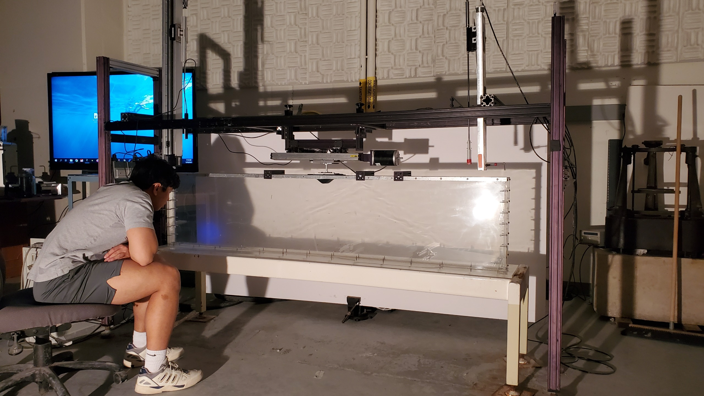

# InternalWavesSetup
Description and how-to of a laboratory setup to produce internal waves and study their dynamics. 

* See the [setup folder](/setup) for details on how we setup, carry out, and observe the internal wave experiments!
* See the [analysis](/analysis) folder for details on how we quantify stratification and create visualizations via Background-Oriented Schlieren.

The accompanying paper holds figures visualizing the buoyancy gradient and energy spectra for wavenumbers. For a look into how the experiment looks in real-time, see this [BOS Video](https://youtu.be/u_GsewbD7Nw), which compares regimes of varying dynamics as discussed in our [other manuscript](https://arxiv.org/abs/2603.13512).

